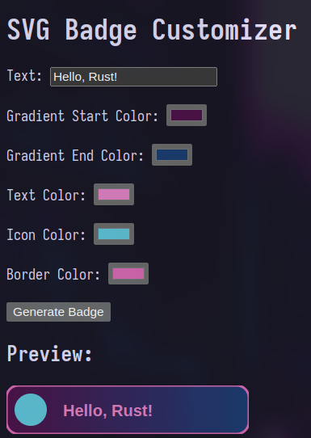

<!--
File: README.md
Repo: <https://github.com/kielmarj/svg-badge-customizer_rust>
© 2024 Jessica Kielmar (GitHub: kielmarj), under The MIT License
Updated: 2024-10-24
-->

<p align="right"><a href="https://mit-license.org/"></a></p>

# SVG Badge Customizer: Rust Project

<p align="center"></p><br>

This project is a learning exercise (my first Rust project) where I explored Rust, SVG manipulation, and HTML interfaces. It uses the warp framework to serve an HTML interface locally. The HTML interface allows users to adjust the text, gradient, border, and icon colors of a simple SVG badge. The badge includes a circular placeholder to represent a future icon. Customizations can be viewed directly in the browser by clicking "Generate Badge," which produces a customized SVG that can be saved locally.



## Project Structure

```
svg-badge-customizer_rust
├── Cargo.toml       # Rust project configuration
├── Cargo.lock       # Dependency lock file
├── src/
│   └── main.rs      # Rust backend that serves the HTML page
├── static/
    └── index.html   # HTML interface for badge customization
```

## How to Run the Project

1. Install Rust: https://www.rust-lang.org/
2. Download a copy of this project:
```
git clone https://github.com/kielmarj/svg-badge-customizer_rust.git
```
3. Build and run:
```
cd svg-badge-customizer_rust
cargo build
cargo run
```
4. Access the interface: Open your browser and go to:
```
http://localhost:3030
```

## License

This project is licensed under the [MIT license](https://mit-license.org/), which means you’re free to use it however you want – modify it, share it, or even sell it – as long as you include the original copyright notice and license. See LICENSE for more details.

## Contributing

I've shared this project to document my personal learning. It isn't really intended to be a ready-made package for use by the general public, and I do not plan to take take it any further at this time. However, please do reach out or contribute if you have ideas, suggestions, or general feedback. I am motivated to learn as much as possible, and your insight would be greatly appreciated!

Thanks for stopping by!

---

<table align="center" border="3"><tr><td align="center"><samp>© 2024 <a href="https://github.com/kielmarj">kielmarj</a></samp><br>
	Licensed under <a href="https://mit-license.org/">The MIT License</a>
</td></tr></table>
